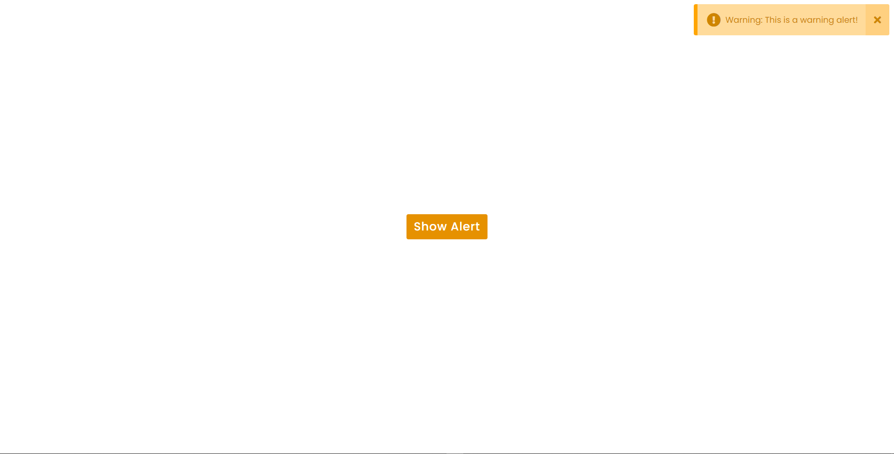

# alert-popup

This is a website which have a button on press of which its shows a popup alert message on press of a button.
It is a good example of HTML, CSS, JavaScript.

and after a press of button its like 

